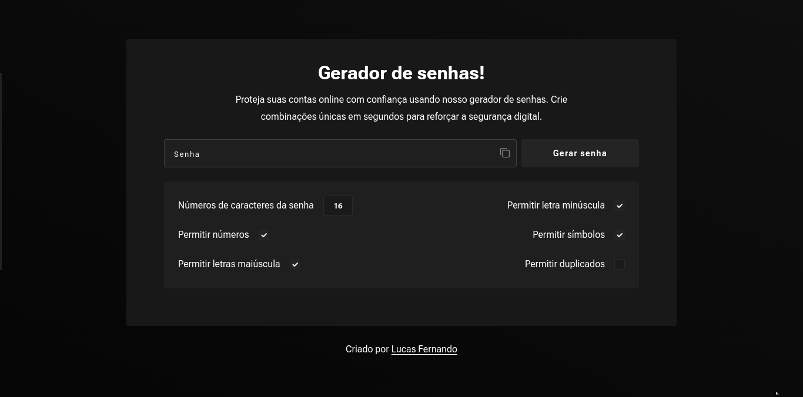

# Password Generator

Este é um projeto criado no figma e desenvolvido usando HTML, CSS3 e JavaScript com o intuito de praticar tanto design quanto programação. A aplicação consiste em um gerador de senhas.
